[](https://travis-ci.org/ryantking/rudder)
[](https://codeclimate.com/github/ryantking/rudder/test_coverage)
[](https://codeclimate.com/github/ryantking/rudder/maintainability)
[](https://goreportcard.com/report/github.com/ryantking/rudder)
[](https://opensource.org/licenses/MIT)


Rudder is a portable tool for continuous delivery of Kubernetes applications. It can handle multiple different
deployments with different conditions for when to update. It is intended to be plugged into to any existing CI/CD
solution, such as Travis-CI that does not have out-of-the-box Kubernetes deployment support.

Rudder is configured by a single configuration file that can be as simple or complex as the project requires.

- [Demo](#demo)
- [Install](#install)
  - [CI Installation](#ci-installation)
  - [Local Installation](#local-installation)
- [Quick Start](#quick-start)
  - [Basic Configuration](#basic-configuration)
  - [CI Setup](#ci-setup)
- [Usage](#usage)
- [Configuration](#configuration)
  - [Branch and Tag](#branch-and-tag)
  - [Kubectl](#kubectl)
  - [Config File](#config-file)
- [Authentication](#authentication)
  - [Kubernetes](#kubernetes)
  - [Docker](#docker)
- [Future Plans](#future-plans)
- [Contributing](#contributing)
- [Thanks](#thanks)
- [License Scan](#license-scan)

## Demo



## Install

### CI Installation

A specific version of the rudder binary canned be installed using the install.sh script:

```bash
# install to $(go env GOPATH)/bin/rudder
curl -sfL https://raw.githubusercontent.com/ryantking/rudder/master/install.sh | sh -s -- -b $(go env GOPATH)/bin vX.Y.Z

# install to ./bin/rudder
curl -sfL https://raw.githubusercontent.com/ryantking/rudder/master/install.sh | sh -s vX.Y.Z
```

Where vX.Y.Z is the desired version (usually latest) from the
[releases page](https://github.com/ryantking/rudder/releases)

### Local Installation

The tool can be installed locally like any other go program:

```bash
go get -u github.com/ryantking/rudder/cmd/rudder
```

Go 1.11 modules allow a specific version to be installed:

```golang
GO111MODULE=on go get github.com/ryantking/rudder/cmd/rudder@v1.2.0
```

## Quick Start

### Basic Configuration

Rudder looks for a file called `.rudder.yml`, `.rudder.yaml`, `.rudder.json`, or `.rudder.toml` in the current
directory and loads the configuration from there.

A single cluster deployment that deploys whenever `master` is tagged looks like this:

```yaml
containers:
  - image: "library/nginx"
deployments:
  - name: prod
    branch: master
    only_tags: true
    kube_servers:
      - server: "https://mycluster.net"
    kube_deployments:
      - "deployment/nginx-deployment"
    yaml_folder: k8s
```

### CI Setup

Installing and using this tool should only require two additional steps in a CD pipeline, the following is an example
for Travis-CI:

```yaml
...

after_success:
  - curl -sfL https://raw.githubusercontent.com/ryantking/rudder/master/install.sh | sh -s -- -b $(go env GOPATH)/bin v1.2.0
  - rudder
```

It can also be done using Travis's deploy steps:

```yaml
...

before_deploy:
  - curl -sfL https://raw.githubusercontent.com/ryantking/rudder/master/install.sh | sh -s -- -b $(go env GOPATH)/bin v1.2.0
deploy:
  provider: script
  script: rudder
```

If desired, Travis parameters can be used to limit the deployments, but Rudder also knows when and what to deploy.

## Usage

Rudder has several command line arguments to have fine-tuned control over it. The flags specific usages are explained
in depth in the following sections

```
> rudder -help
Usage of rudder:
  -branch string
        Current branch
  -image-tag string
        Tag to use for Docker image
  -kube-config string
        Location of kube config (default "$HOME/.kube/config")
  -kubectl-version string
        Version of kubectl to use (default latest)
  -tag string
        Current tag
  -use-master
        Don't substitute 'master' with 'latest'
```

## Configuration

Way more can be done than just a single cluster, the following is a configuration that adds a canary deployment to a
different namespace, with both prod and canary have deployments on two different clusters:

```yaml
containers:
  - image: "library/nginx"
deployments:
  - name: prod
    branch: master
    only_tags: true
    tags:
      - "v*"
      - "multi-v*"
    kube_servers:
      - server: "https://k1.mycluster.net"
      - server: "https://k2.mycluster.net"
    kube_namespace: myproj
    kube_deployments:
      - "deployment/nginx-deployment"
    yaml_folder: k8s/prod
  - name: canary
    branch: master
    only_tags: true
    tags:
      - "canary-v*"
      - "multi-v*"
    kube_servers:
      - server: "https://k1.mycluster.net"
      - server: "https://k2.mycluster.net"
    kube_namespace: myproj-canary
    kube_deployments:
      - "deployment/nginx-deployment"
    yaml_folder: k8s/canary
```

This translates to Rudder deploying to production whenever `master` is tagged with a tag that starts with `multi-v` or
`v` in the `myproj` namespace and deploying the canary whenever `master` is tagged a tag that starts with `canary-v` or
`multi-v`.

Currently Rudder tagging supports basic pattern matching with '*' being used as a wildcard that can match any number
of characters.

### Branch and Tag

Currently, Rudder only knows how to find branch and tag information from Travis-CI, but more CI/CD solutions will be
added in the future.

Generically, the branch and tag can be added via command-line flags `branch` and `tag`:

```bash
rudder -branch=$MY_BRANCH_VAR -tag=$MY_TAG_VAR
```

The tag for the image is set using the following logic, skipping any steps where the required variables are empty:

1. The passed `-image-tag` flag
2. The git tag, either found via known-variables (such as $TRAVIS_TAG) or provided via the `-tag` flag
3. The git branch, either found via known-variables (such as $TRAVIS_BRANCH) or provided via the `-branch` flag

Note that if the branch is used as the image tag, `master` is replaced with `latest`, unless the `use-master` flag is
set.

### Kubectl

All the interaction with Kubernetes is done via wrapped calls to `kubectl`. Installation and generation of the config
file is done automatically. By default, the latest stable release of `kubectl` is installed, but a version can be set
using the `-kubectl-version` flag.

`$HOME/kube/config` is used by default, for the `kubectl` config file, but a different one can be set with the
`kube-config` flag.

### Config File

Here is an example configuration file with default values filled in and explanation.

```yaml
# Configuration for the containers required for deployment
containers:
  - # Registry that hosts the image
    registry: https://index.docker.io # Docker Hub

    # Image to wait to build
    image: # REQUIRED

    # Timeout for waiting for the image to become available
    timeout: "5m"

# User configuration for interacting with Kubernetes
user:
    # Name of the user
    name: default

    # Path to the client certificate
    client_certificate:

    # Path to the client key
    client_key:

# Deployment configurations
deployments:
  - # Name of the deployment
    name: # REQUIRED

    # Branch to execute the deployment on
    branch: master

    # Only deploy on tagged releases
    only_tags: false

    # Tag patterns to match
    tags:

    # Folder of YAML Kubernetes resources to apply
    yaml_folder: "k8s"

    # Kubernetes Servers to apply the deployments to
    kube_servers:
      - # URL of the server
        server: # REQUIRED

        # Path to the certificate authority
        ca:

    # Kubernetes namespace to apply the deployments in
    kube_namespace: default

    # Kubernetes deployments to watch for rollout
    kube_deployments:
```

## Authentication

### Kubernetes

Currently, Rudder supports both token based authentication and certificate based authenciation.

The Kubernetes token to use comes from the environment variable `$KUBE_TOKEN`.

Certificate-based authentication is configured with the paths to the CA, certificate, and key found in the config.

### Docker

Currently no support for docker registry configuration, but will be added in the near future.

## Future Plans

1. Support authentication for Docker registries
2. A strong integration test suite that uses a test Kubernetes cluster to validate Kubernetes operations.
3. Replace `kubectl` calls with the Kubernetes golang client


## Contributing

Feel free to open issues and pull requests for anything that would make this project more useful or easier to maintain.

Would especially appreciate help from folks who use other container registers with varying authentication schemes such
as GitLab Container Registry and AWS ECR as well as those who use the various managed Kubernetes solutions.

## Thanks

I would like to call out some projects/teams that were heavy help and inspiration to me:

- My incredible team at [Cogo Labs](https://cogolabs.com) (see their [GitHub](https://github.com/cogolabs) for more
open source GOodness), whose work with Kubernetes, and endless knowledge I've gained there made this endeavor possible.
- [GolangCI](https://github.com/golangci) who's fantastic tool, [GolangCI](https://github.com/golangci/golangci-lint),
has been a huge resources for me in writing quality Go code that I hope to be used by the public, such as the goreleaser
configuration (and how to actually write a helpful README!)
- [The Kubernetes Team](https://github.com/kubernetes/) for creating one hell of a container orchestration engine.
- [The Golang Team](https://github.com/golang) for creating an incredible toolchain behind a fantastic compiler built
off of a gloriously simple language spec.
- Everyone in the Golang/Docker/Kubernetes community that has built a phenomenal ecosystem around some wonderful tools.

## License Scan

[](https://app.fossa.com/projects/custom%2B12297%2Fgithub.com%2Fryantking%2Frudder?ref=badge_large)
